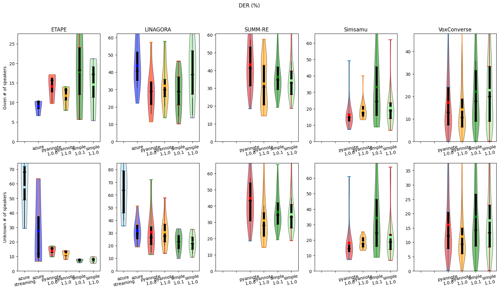
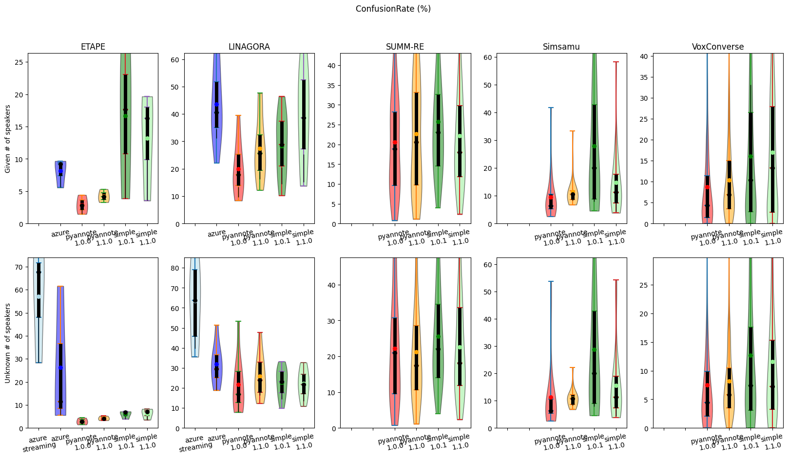
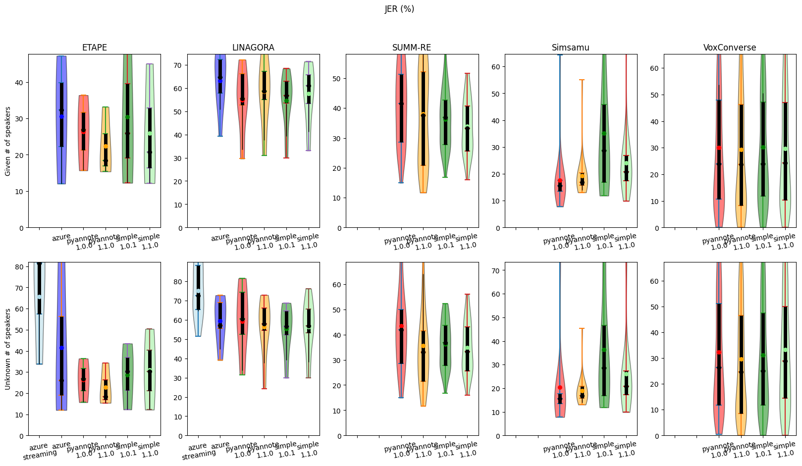
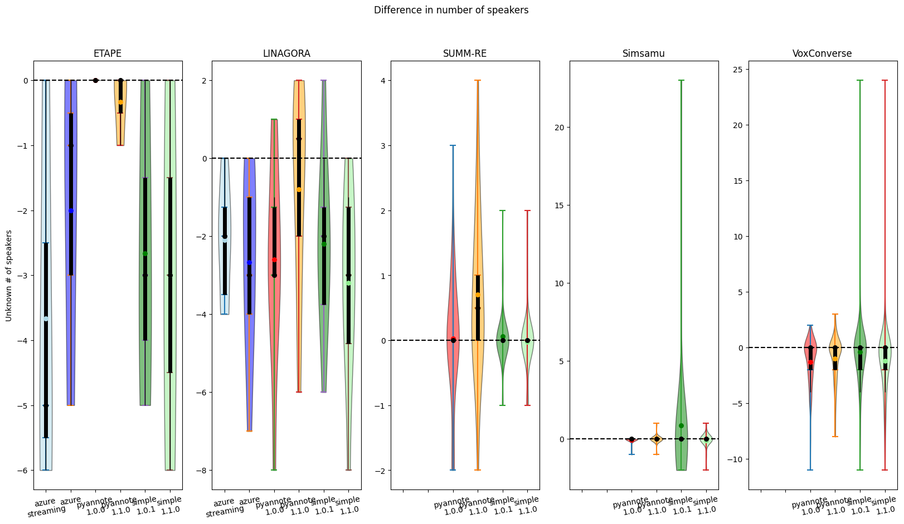
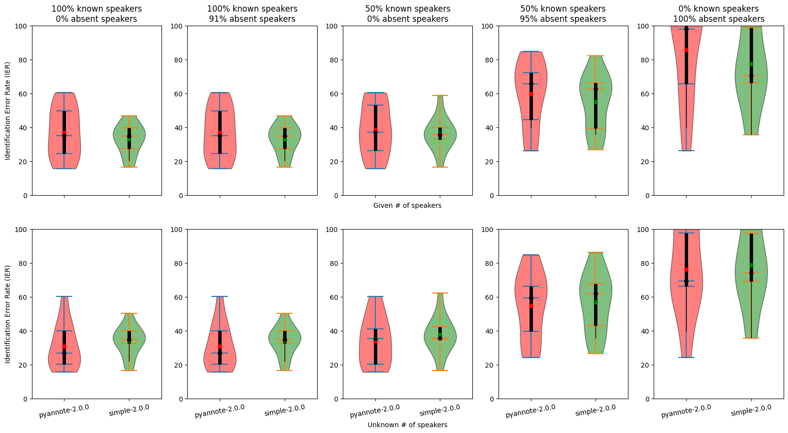
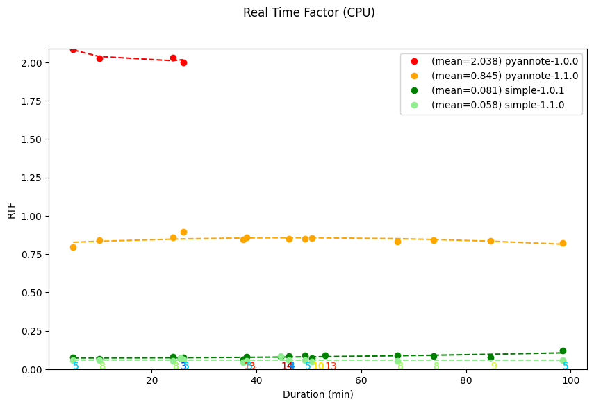
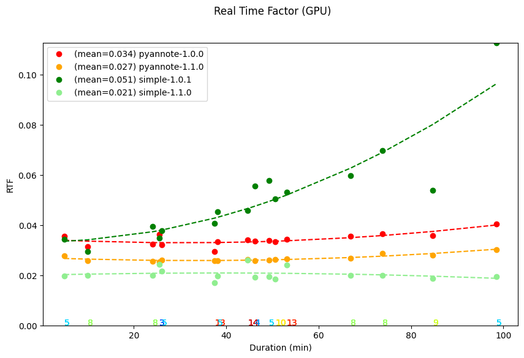
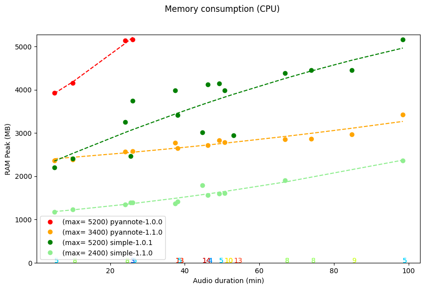
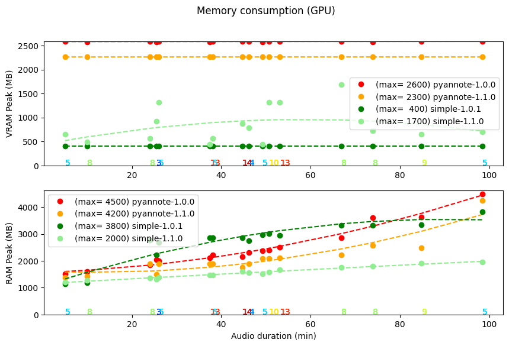

# Benchmark of Linto AI Speaker Diarization

This is the benchmark of [linto-ai/linto-diarization](https://github.com/linto-ai/linto-diarization),
i.e. of images on [LinTO dockerhub](https://hub.docker.com/u/lintoai):
* [`lintoai/linto-diarization-simple`](https://hub.docker.com/r/lintoai/linto-diarization-simple)
* [`lintoai/linto-diarization-pyannote`](https://hub.docker.com/r/lintoai/linto-diarization-pyannote)
* [`lintoai/linto-diarization-pybk`](https://hub.docker.com/r/lintoai/linto-diarization-pybk)

which were previously (before a refactoring) all on [linto-platform-diarization](https://hub.docker.com/r/lintoai/linto-platform-diarization/tags)
(versions 1.X.X were for `pybk`, 2.X.X were for `pyannote` and 3.X.X were for `simple`).

# Table of content
* [Experimental setup](#experimental-setup)
    * [Dataset description](#dataset-description)
* [Current results](#current-results)
    * [Accuracies](#accuracies)
        * [Speaker Diarization](#speaker-diarization)
            * [Diarization Error Rate (DER%)](#diarization-error-rate-der)
            * [Speaker Confusion Error Rate](#speaker-confusion-error-rate)
            * [Jaccard Error Rate (JER%)](#jaccard-error-rate-jer)
            * [Difference between predicted and actual number of speakers](#difference-between-predicted-and-actual-number-of-speakers)
        * [Speaker Identification](#speaker-identification)
            * [Identification Error Rates](#identification-error-rates)
    * [Performance](#performance)
        * [Inference time](#inference-time)
            * [CPU](#cpu)
            * [GPU](#gpu)
        * [Memory consumption](#memory-consumption)
            * [CPU](#cpu-1)
            * [GPU](#gpu-1)

# Experimental setup
## Dataset description

We use the following dataset, for which we have the ground truth in terms of speaker diarization:
* ETAPE: corpus of 3 radio recordings.
* LINAGORA: corpus of 8 meeting recordings.
* SUMM-RE: corpus of 34 simulated meetings of around 30 minutes, with 4 participants (sometimes only 3 speaking).
* Simsamu: corpus of 23 simulated emergency calls, with 2 (sometimes 3) participants. Only corpus where original files have a sampling rate of 8kHz (others use 16 kHz).
* VoxConverse: corpus of 232 YouTube video. This benchmark is commonly used to evaluate speaker diarization.

# Current results
## Accuracies

### Speaker Diarization

#### Diarization Error Rate (DER%)

The Diarization Error Rate (DER) is the most commonly used metric to evaluate the performance of speaker diarization systems.

The lower the DER, the better.

<!-- In HTML, the formula DER = (speaker confusion + speaker missed + speaker false alarm) / total speech duration. -->
$$
\text{DER} = \frac{(\text{speaker confusion} + \text{speaker missed} + \text{speaker false alarm})}{\text{total speech duration}}
$$
<!-- 

    <math>
        <mi>DER</mi>
        <mo>=</mo>
        <mfrac>
        <mn>
            (
            speaker confusion
            + speaker missed
            + speaker false alarm
            )
        </mn>
        <mi>
            total speech duration
        </mi>
        </mfrac>
    </math>

 -->

The overall DER for the different systems on several datasets are the following:

<!-- 🚧 ❓ -->

__with given number of speakers:__
| Engine                             |       ETAPE |    LINAGORA |     SUMM-RE |     Simsamu | VoxConverse |
|------------------------------------|-------------|-------------|-------------|-------------|-------------|
| azure                              |     **9.51**|       44.44 |       _____ |       _____ |       _____ |
| linto-pyannote 1.0.0 (pyannote 2.1)|       15.06 |   **30.16** |       43.98 |   **15.84** |       16.57 |
| linto-pyannote 1.1.0 (pyannote 3.1)|       12.49 |       33.66 |   **34.08** |       18.35 |   **13.67** |
| linto-simple 1.0.1  (silero v4)    |       19.88 |   **30.38** |       37.03 |       30.74 |       21.14 |
| linto-simple 1.1.0  (silero v3)    |       16.20 |       40.12 |       35.23 |       19.67 |       23.22 |
| linto-simple 1.1.1 (silero v5)     |       17.82 |       41.50 |       37.00 |       28.85 |       23.78 |
 
__with unknown number of speakers:__
| Engine                             |       ETAPE |    LINAGORA |     SUMM-RE |     Simsamu | VoxConverse |
|------------------------------------|-------------|-------------|-------------|-------------|-------------|
| azure streaming                    |  ❓  63.44 |  ❓  72.50 |       27.78 |       _____ |       _____ |
| azure                              |  ❓  29.53 |       34.12 |       17.30 |       _____ |       _____ |
| linto-pyannote 1.0.0 (pyannote 2.1)|       15.06 |       32.24 |       45.57 |   **16.75** |       14.23 |
| linto-pyannote 1.1.0 (pyannote 3.1)|       12.47 |       32.03 |   **32.52** |       17.78 |   **11.12** |
| linto-simple 1.0.1  (silero v4)    |     **7.50**|   **23.62** |       37.21 |       30.88 |       16.29 |
| linto-simple 1.1.0  (silero v3)    |     **8.05**|   **23.02** |       35.82 |       21.02 |       15.43 |
| linto-simple 1.1.1 (silero v5)     |       8.23  |     23.18   |       37.19 |       28.55 |       14.62 |

<!-- ⁽ⱽ⁾ : The problem of high DER of linto-simple on SimSamu is due to the Voice Activity Detection (VAD) that is removing too much speed.
This is under investigation. -->

The following plot shows the distributions of DER values (per audio) on several datasets
(for each distribution, the red marker indicates the average value, horizontal lines indicate median, 25% and 75% quartiles, as well as extreme values).

#### Speaker Confusion Error Rate

This is a variant of the DER where we ignore speaker false alarms.
Indeed, in practice, speaker false alarms does not really have an influence when diarization is combined with the (timestamped) output of an ASR system
(considering that ASR should not predict words on silence).

#### Jaccard Error Rate (JER%)

The Jaccard Error Rate (JER) is similar to the DER but assigns equal weight to each speaker's contribution, regardless of their speech duration.

#### Difference between predicted and actual number of speakers
The following plot shows the distributions of the difference between the predicted number of speakers and the actual number of speakers.

### Speaker Identification

#### Identification Error Rates

The Identification Error Rate (IER) is just the speaker classification error rates over time.
It is like the DER but without the need to match the speaker labels.

The following plot shows the distributions of IER values (per audio) depending on the set up,
which depends on the ratio of speakers of the recording that are known in advance,
and the ratio of known speakers that are not speaking on the recording.

## Performance

### Inference time

The following plots show the Real Time Factor (RTF) of the different systems on several datasets, depending on the input audio duration
(number of speakers can also have an influence on the RTF and are indicated with a colormap at the bottom).

The RTF is the ratio between the duration of the diarization process and the duration of the audio.

The lower the RTF, the better.

#### CPU

#### GPU
The following benchmark was run on NVIDIA GeForce GTX 1080 Ti (11.3GB of VRAM)

### Memory consumption

The following plots show the RAM and VRAM consumption of the different systems on several datasets, depending on the input audio duration
(number of speakers can also have an influence on the RTF and are indicated with a colormap at the bottom).

#### CPU

#### GPU

