# Benchmark of Linto AI Speaker Diarization

This is the benchmark of [linto-ai/linto-diarization](https://github.com/linto-ai/linto-diarization),
i.e. of images on [LinTO dockerhub](https://hub.docker.com/u/lintoai):
* [`lintoai/linto-diarization-simple`](https://hub.docker.com/r/lintoai/linto-diarization-simple)
* [`lintoai/linto-diarization-pyannote`](https://hub.docker.com/r/lintoai/linto-diarization-pyannote)
* [`lintoai/linto-diarization-nemotron`](https://hub.docker.com/r/lintoai/linto-diarization-nemotron)
* [`lintoai/linto-diarization-pybk`](https://hub.docker.com/r/lintoai/linto-diarization-pybk) (deprecated)

which were previously (before a refactoring) all on [linto-platform-diarization](https://hub.docker.com/r/lintoai/linto-platform-diarization/tags)
(versions 1.X.X were for `pybk`, 2.X.X were for `pyannote` and 3.X.X were for `simple`).

# Table of content
* [Experimental setup](#experimental-setup)
    * [Dataset description](#dataset-description)
* [Current results](#current-results)
    * [Accuracies](#accuracies)
        * [Speaker Diarization](#speaker-diarization)
            * [Diarization Error Rate (DER%)](#diarization-error-rate-der)
            * [Speaker Confusion Error Rate](#speaker-confusion-error-rate)
            * [Jaccard Error Rate (JER%)](#jaccard-error-rate-jer)
            * [Difference between predicted and actual number of speakers](#difference-between-predicted-and-actual-number-of-speakers)
        * [Speaker Identification](#speaker-identification)
            * [Identification Error Rates](#identification-error-rates)
    * [Performance](#performance)
        * [Inference time](#inference-time)
            * [CPU](#cpu)
            * [GPU](#gpu)
        * [Memory consumption](#memory-consumption)
            * [CPU](#cpu-1)
            * [GPU](#gpu-1)

# Experimental setup
## Dataset description

We use the following dataset, for which we have the ground truth in terms of speaker diarization:
* ETAPE: corpus of 3 radio recordings, from the [ETAPE corpus](https://catalogue.elra.info/en-us/repository/browse/ELRA-E0046/) (ELRA-E0046).
* LINAGORA: corpus of 10 meeting recordings. The 8 `Linagora_*` files are available in [LINAGORA_Meetings_fr](https://dl.labs.linagora.com/files/datasets/OpenLLM-France/Luciole-Audio-Training-Dataset/audio/speech/LINAGORA_Meetings_fr) (longer file names, same audio). The 2 `meeting_RAP_*` files are not public.
* SUMM-RE: corpus of 34 simulated meetings of around 30 minutes, with 4 participants (sometimes only 3 speaking).
* Simsamu: corpus of 23 simulated emergency calls, with 2 (sometimes 3) participants. Only corpus where original files have a sampling rate of 8kHz (others use 16 kHz).
* VoxConverse: corpus of 232 YouTube video. This benchmark is commonly used to evaluate speaker diarization.

The audio is not in this repository. `run_benchmark.py` reads it from `data/benchmark/wav`, and `run_benchmark_identification.py`
from `data/benchmark_identification/wav` and `data/benchmark_identification/speakers_samples` (other folders can be given as arguments).
The references are in `data/rttm` and `data/rttm_identification`.
At LINAGORA, all the audio is on the data server, in `/data-server/datasets/audio/raw/speaker/diarization/LinTO_benchmark/wav`
and `/data-server/datasets/audio/raw/speaker/identification/LinTO_benchmark/`.

# Current results
## Accuracies

### Speaker Diarization

#### Diarization Error Rate (DER%)

The Diarization Error Rate (DER) is the most commonly used metric to evaluate the performance of speaker diarization systems.

The lower the DER, the better.

<!-- In HTML, the formula DER = (speaker confusion + speaker missed + speaker false alarm) / total speech duration. -->
$$
\text{DER} = \frac{(\text{speaker confusion} + \text{speaker missed} + \text{speaker false alarm})}{\text{total speech duration}}
$$
<!-- <div>
    <math>
        <mi>DER</mi>
        <mo>=</mo>
        <mfrac>
        <mn>
            (
            speaker confusion
            + speaker missed
            + speaker false alarm
            )
        </mn>
        <mi>
            total speech duration
        </mi>
        </mfrac>
    </math>
</div> -->


The overall DER for the different systems on several datasets are the following:

<!-- 🚧 ❓ -->

__with given number of speakers:__
| Engine                             |       ETAPE |    LINAGORA |     SUMM-RE |     Simsamu | VoxConverse |
|------------------------------------|-------------|-------------|-------------|-------------|-------------|
| linto-simple 1.0.1  (silero v4)    |       19.88 |       30.38 |       37.03 |       30.74 |       21.14 |
| linto-simple 1.1.0  (silero v3)    |       16.20 |       40.12 |       35.23 |       19.67 |       23.22 |
| linto-simple 1.1.1  (silero v5)    |       17.82 |       41.50 |       37.00 |       28.85 |       23.78 |
| linto-pyannote 1.0.0 (pyannote 2.1)|       15.06 |   **30.16** |       43.98 |   **15.84** |       16.57 |
| linto-pyannote 1.1.0 (pyannote 3.1)|       12.49 |       33.66 |       34.08 |       18.35 |       13.67 |
| linto-pyannote 2.3.0 (community-1) ⁽²⁾ |   28.76 |       42.50 |       29.41 |       18.38 |       22.36 |
| linto-nemotron 1.1.0 ⁽¹⁾           |       23.34 |       36.08 |   **19.08** |       17.29 |    **8.24** |
<!-- | azure                              |     **9.51**|       44.44 |       _____ |       _____ |       _____ | -->
 
__with unknown number of speakers:__
| Engine                             |       ETAPE |    LINAGORA |     SUMM-RE |     Simsamu | VoxConverse |
|------------------------------------|-------------|-------------|-------------|-------------|-------------|
| linto-simple 1.0.1  (silero v4)    |     **7.50**|   **23.62** |       37.21 |       30.88 |       16.29 |
| linto-simple 1.1.0  (silero v3)    |     **8.05**|   **23.02** |       35.82 |       21.02 |       15.43 |
| linto-simple 1.1.1  (silero v5)    |       8.23  |     23.18   |       37.19 |       28.55 |       14.62 |
| linto-pyannote 1.0.0 (pyannote 2.1)|       15.06 |       32.24 |       45.57 |   **16.75** |       14.23 |
| linto-pyannote 1.1.0 (pyannote 3.1)|       12.47 |       32.03 |       32.52 |       17.78 |       11.12 |
| linto-pyannote 2.3.0 (community-1) |       12.80 |       29.49 |       28.88 |       19.25 |       11.07 |
| linto-nemotron 1.1.0 ⁽¹⁾           |       23.34 |       36.08 |   **19.08** |       17.29 |    **8.24** |
<!-- | azure streaming                    |  ❓  63.44 |  ❓  72.50 |       27.78 |       _____ |       _____ |
| azure                              |  ❓  29.53 |       34.12 |       17.30 |       _____ |       _____ | -->

⁽¹⁾ Nemotron 3 Diarization (image `1.1.0-compiled`). It finds the number of speakers by itself, up to 8, and ignores the given number: both rows are the same.
61 VoxConverse files have more than 8 speakers (11.7 on average), as well as 2 of the 3 ETAPE files (14 and 13) and 3 of the 10 LINAGORA files (9, 10 and 13).
The ETAPE and LINAGORA references label almost the whole recording as speech, pauses inside turns included (98% and 99.9% of the duration, vs 81% for SUMM-RE and Simsamu).
On LINAGORA, most of the gap with linto-pyannote 2.3.0 is missed speech (25.7% vs 14.6%, average per file), while speaker confusion is lower (6.0% vs 9.4%).

⁽²⁾ With a given number of speakers, pyannote.audio 4 (community-1) clusters again with KMeans when that number differs from the one found by VBx,
which is much worse (ETAPE 28.76 instead of 12.80, LINAGORA 42.50 instead of 29.49, VoxConverse 22.36 instead of 11.07). pyannote.audio used directly gives the same result.

<!-- ⁽ⱽ⁾ : The problem of high DER of linto-simple on SimSamu is due to the Voice Activity Detection (VAD) that is removing too much speed.
This is under investigation. -->

The following plot shows the distributions of DER values (per audio) on several datasets
(for each distribution, the red marker indicates the average value, horizontal lines indicate median, 25% and 75% quartiles, as well as extreme values).
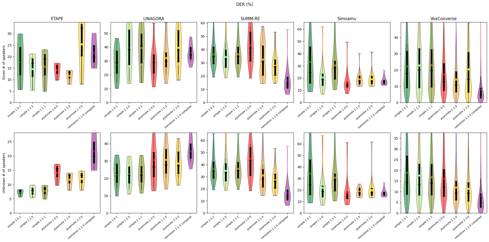

#### Speaker Confusion Error Rate

This is a variant of the DER where we ignore speaker false alarms.
Indeed, in practice, speaker false alarms does not really have an influence when diarization is combined with the (timestamped) output of an ASR system
(considering that ASR should not predict words on silence).

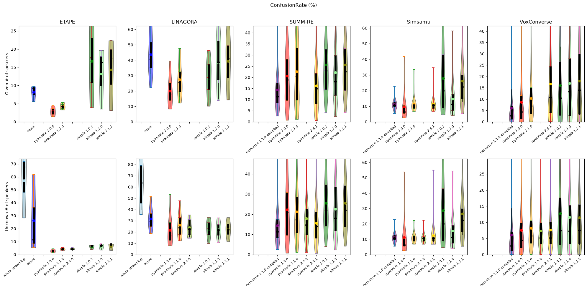

#### Jaccard Error Rate (JER%)

The Jaccard Error Rate (JER) is similar to the DER but assigns equal weight to each speaker's contribution, regardless of their speech duration.

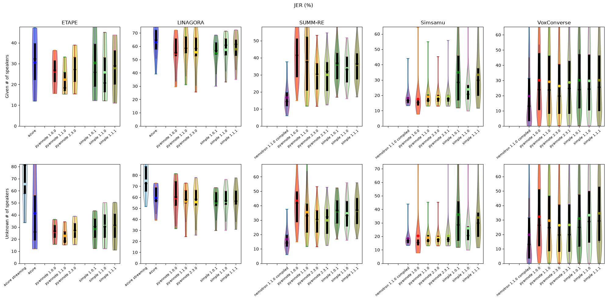

#### Difference between predicted and actual number of speakers
The following plot shows the distributions of the difference between the predicted number of speakers and the actual number of speakers.
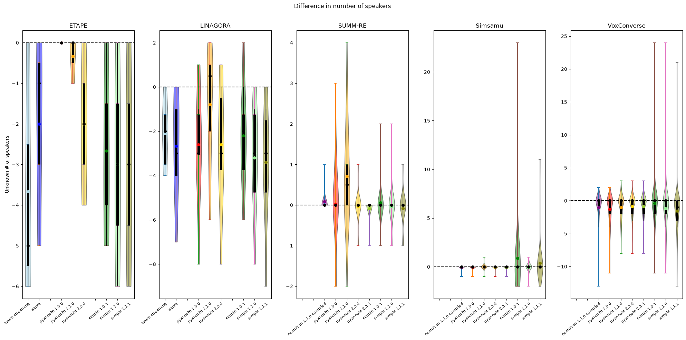

### Speaker Identification

The speaker identification benchmark (`run_benchmark_identification.py`) requires a
[Qdrant](https://qdrant.tech) server, used by recent `linto-diarization-pyannote` and `linto-diarization-nemotron` images
to store and match speaker embeddings. The script does not start it, so start one before the run:

```bash
docker run -d --rm --name qdrant_diarization_bench -p 6333:6333 -v ./qdrant_storage:/qdrant/storage:z qdrant/qdrant
```

The diarization container reaches it on `host.docker.internal:6333`. Use `--qdrant_host` / `--qdrant_port` to point to another server.
Each image fills its own collection (`speakers_<image>_<tag>`) with the voiceprints of `speakers_samples` when it starts.

#### Identification Error Rates

The Identification Error Rate (IER) is just the speaker classification error rates over time.
It is like the DER but without the need to match the speaker labels.

The following plot shows the distributions of IER values (per audio) depending on the set up,
which depends on the ratio of speakers of the recording that are known in advance,
and the ratio of known speakers that are not speaking on the recording.

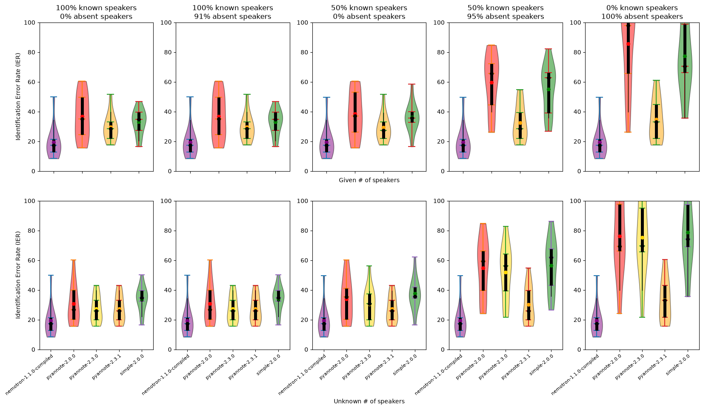

linto-nemotron 1.1.0 and linto-pyannote 2.3.0 were run on the RTX 4090 laptop. Since these versions, a voiceprint must reach a similarity of 0.66 (0.5 before)
and an enrolled speaker is given to one diarized speaker at most. When none of the speakers of the recording is enrolled (last column, unknown number of speakers),
the average IER per file is 75.3 for linto-pyannote 2.3.0 (25 wrong names on 13 recordings), 33.5 for linto-pyannote 2.3.0 (3 wrong names) and 19.4 for linto-nemotron 1.1.0 (1 wrong name).
The linto-pyannote 2.3.0 run with a given number of speakers was removed (the number was not sent).

The overall IER sums the errors of the 13 recordings, so long recordings weigh more than in the plot.
Columns: share of the speakers of the recording that are enrolled, share of the enrolled speakers that do not speak in the recording.
linto-nemotron ignores the given number of speakers, so it has the same scores in both tables.

__with given number of speakers:__
| Engine                  | 100% known, 0% absent | 100% known, 91% absent | 50% known, 0% absent | 50% known, 95% absent | 0% known, 100% absent |
|-------------------------|----------:|----------:|----------:|----------:|----------:|
| linto-nemotron 1.1.0    | **22.63** | **22.63** | **22.57** | **22.70** | **22.70** |
| linto-pyannote 2.0.0    |     38.72 |     38.72 |     40.17 |     59.53 |     82.45 |
| linto-pyannote 2.3.0    |     31.31 |     31.31 |     31.10 |     34.03 |     35.42 |
| linto-simple 2.0.0      |     34.13 |     34.13 |     37.00 |     54.15 |     72.96 |

__with unknown number of speakers:__
| Engine                  | 100% known, 0% absent | 100% known, 91% absent | 50% known, 0% absent | 50% known, 95% absent | 0% known, 100% absent |
|-------------------------|----------:|----------:|----------:|----------:|----------:|
| linto-nemotron 1.1.0    | **22.63** | **22.63** | **22.57** | **22.70** | **22.70** |
| linto-pyannote 2.0.0    |     32.87 |     32.87 |     35.84 |     54.72 |     72.83 |
| linto-pyannote 2.3.0    |     29.60 |     29.60 |     29.53 |     32.36 |     34.43 |
| linto-simple 2.0.0      |     34.97 |     34.97 |     38.26 |     55.27 |     73.89 |

## Performance

### Inference time

The following plots show the Real Time Factor (RTF) of the different systems on several datasets, depending on the input audio duration
(number of speakers can also have an influence on the RTF and are indicated with a colormap at the bottom).

The RTF is the ratio between the duration of the diarization process and the duration of the audio.

The lower the RTF, the better.

#### CPU
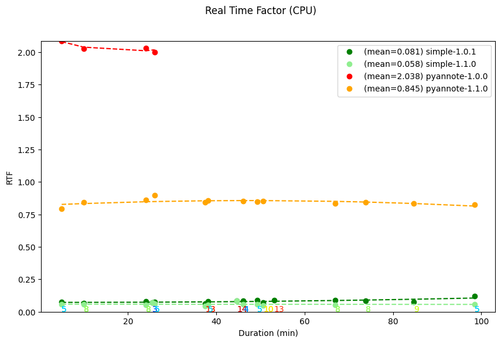
#### GPU
The following benchmark was run on NVIDIA GeForce GTX 1080 Ti (11.3GB of VRAM)
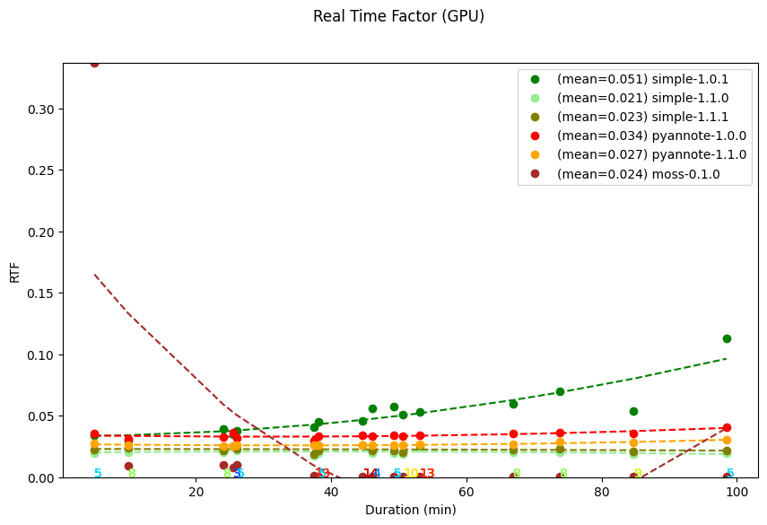

linto-nemotron 1.1.0 and linto-pyannote 2.3.0 were run on another GPU (NVIDIA GeForce RTX 4090 Laptop, 16 GB of VRAM), with an unknown number of speakers:

| Engine                  | ETAPE (2.1 h) | LINAGORA (7.3 h) | SUMM-RE (11.2 h) | Simsamu (1.1 h) | VoxConverse (43.5 h) | VRAM peak |
|-------------------------|---------------|------------------|------------------|-----------------|----------------------|-----------|
| linto-nemotron 1.1.0    | RTF 0.0008    | RTF 0.0008       | RTF 0.0009       | RTF 0.0010      | RTF 0.0010           | 3.8 GB    |
| linto-pyannote 2.3.0    | RTF 0.0215    | RTF 0.0215       | RTF 0.0208       | RTF 0.0218      | RTF 0.0220           | 3.7 GB    |

These plots use the same files as the 1080 Ti plots above
(`python3 plot_memory_time.py figs/rtx4090_laptop --only 'nemotron|pyannote-2.3.0'`).
The 1080 Ti plots leave these two runs out (`python3 plot_memory_time.py figs --only '^(?!nemotron|pyannote-2\.3\.0)'`).
The first point of linto-nemotron (RTF 0.012) is the warm-up of the compiled model.
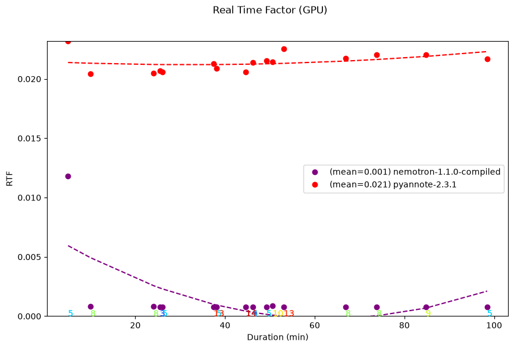

### Memory consumption

The following plots show the RAM and VRAM consumption of the different systems on several datasets, depending on the input audio duration
(number of speakers can also have an influence on the RTF and are indicated with a colormap at the bottom).

#### CPU
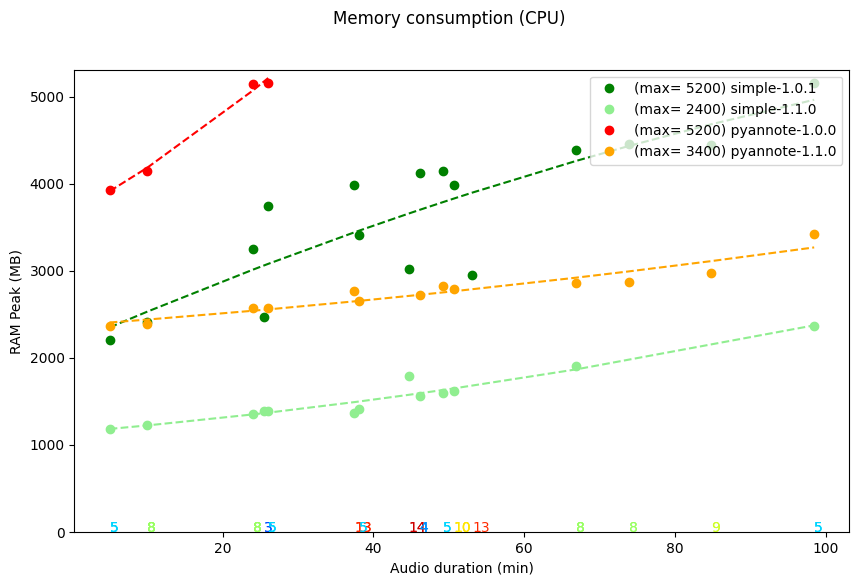
#### GPU
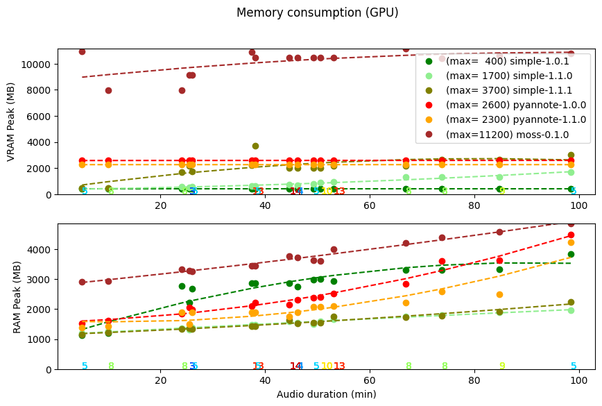

linto-nemotron 1.1.0 and linto-pyannote 2.3.0 on NVIDIA GeForce RTX 4090 Laptop (see above):
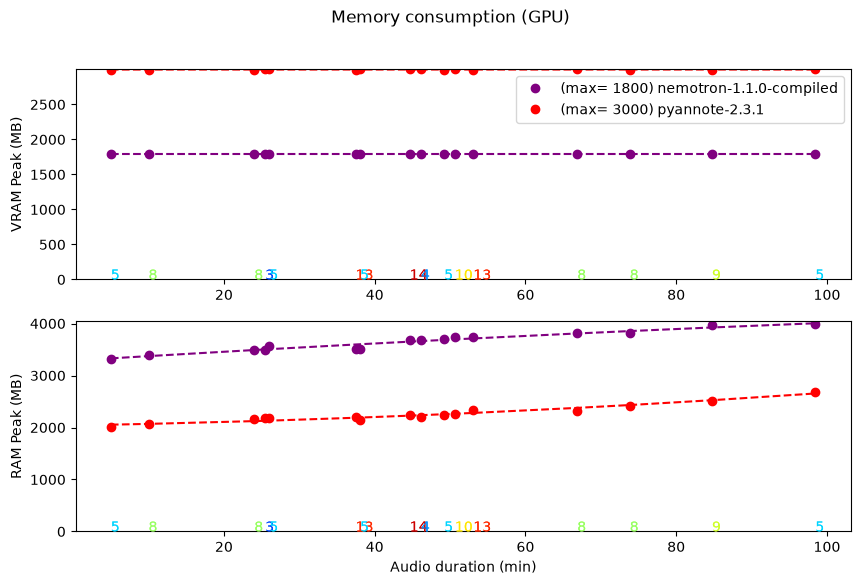
